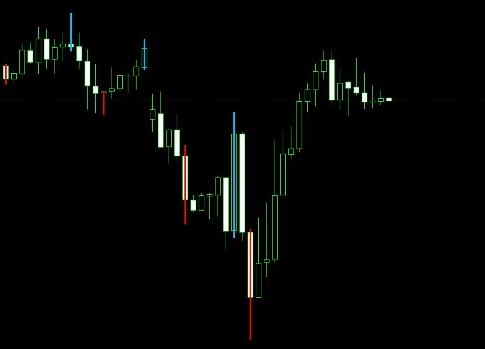

# ttm_scalper_alert_MQL4

This indicator is for MetaTrader MQL4

#Description

The TTM_ScalperAlert is a great tool for runaway markets. Timing entry into a runaway market is haphazard at best and can be akin to stepping in front of a freight train. By waiting for a scalper alert to fire off, a trader can be sure that momentum has at least paused and allows an entry at a possible turning point with a precise risk reward ratio in place.

The TTM_ScalperAlert comprises two plots, Pivot High and Pivot Low. Pivot High is shown as an arrow above the first bar in a series of 3 lower Closes (Sell signal). Pivot Low is shown as an arrow under the first bar in a series of 3 higher Closes (Buy signal).

##Instalation

copy both files inside 
MetaQuotes\Terminal\MQL4\Indicators

## Picture of template

